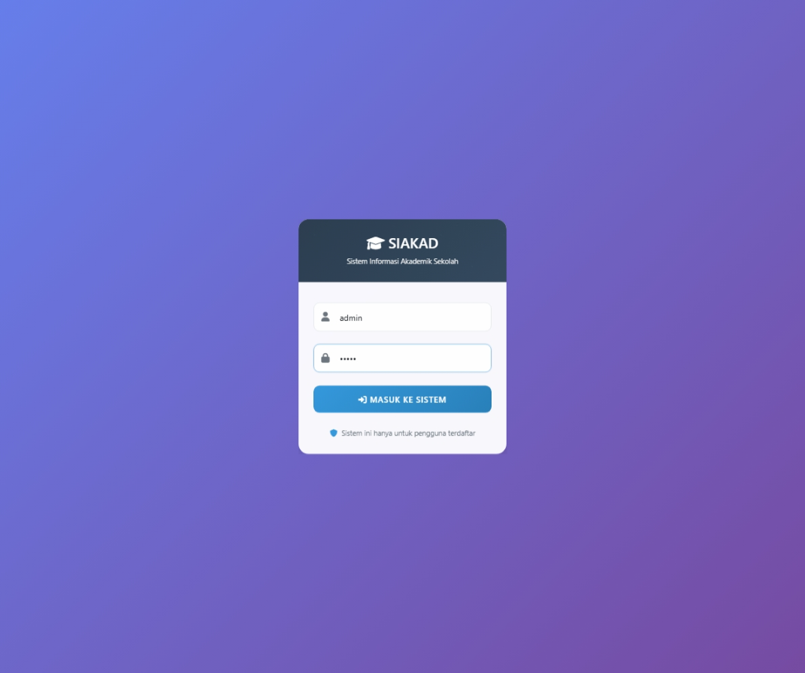
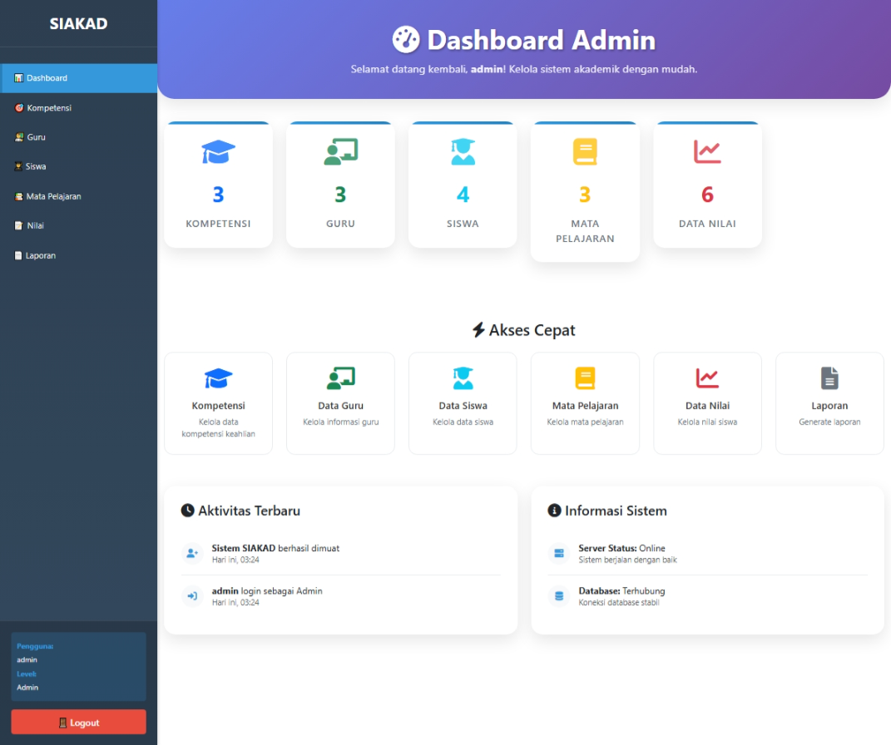
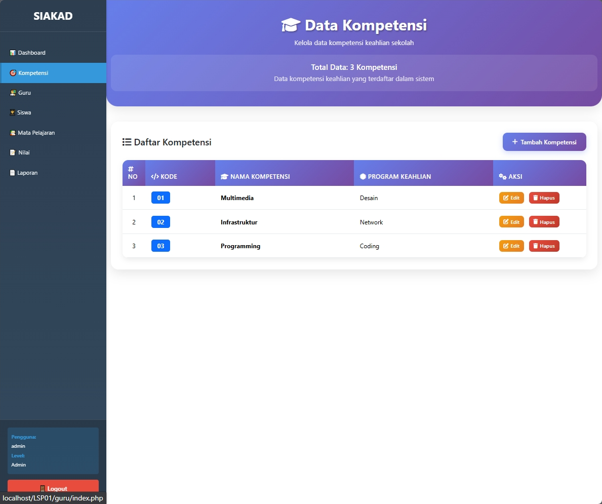
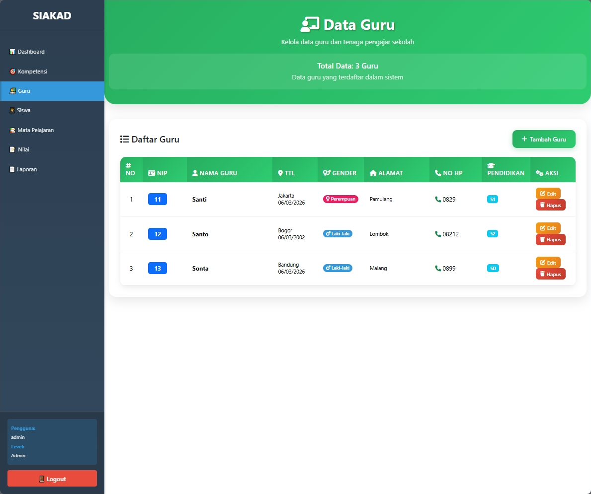
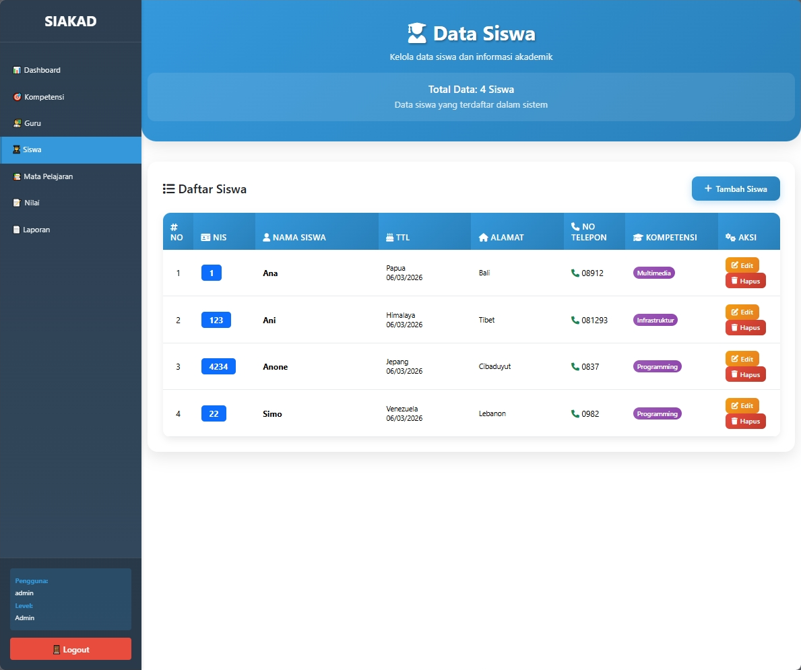
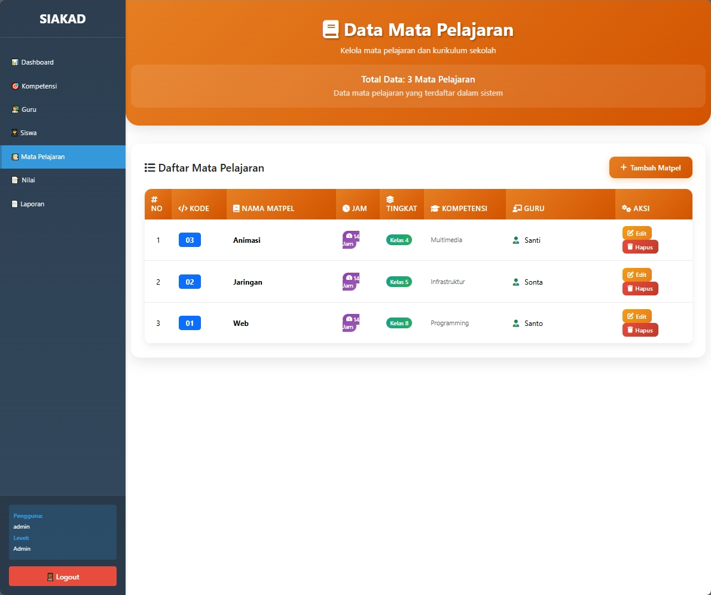
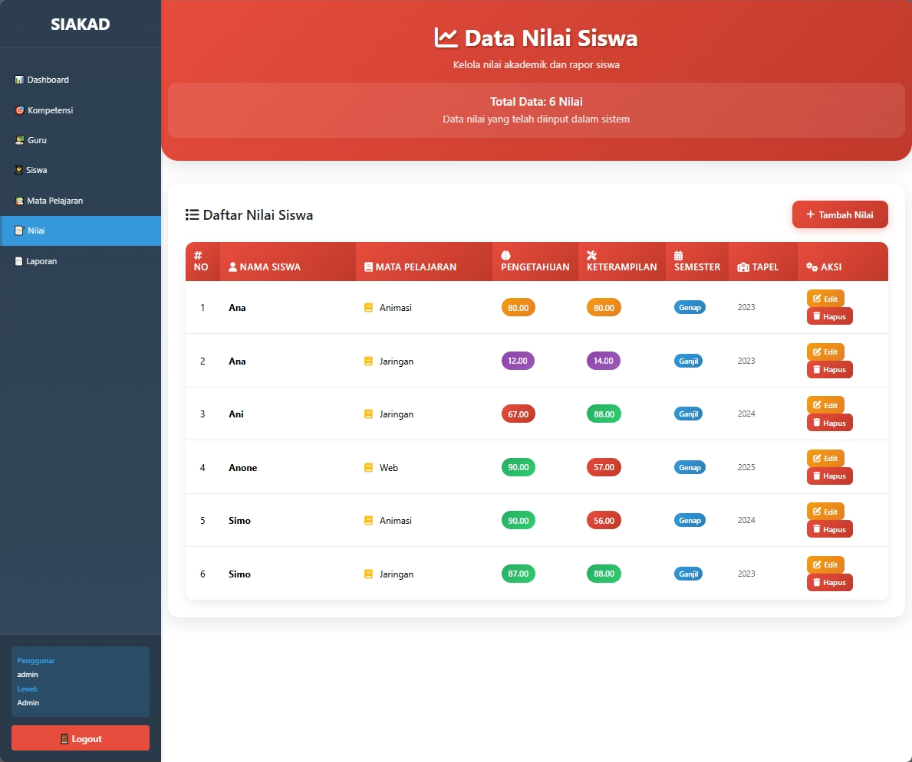
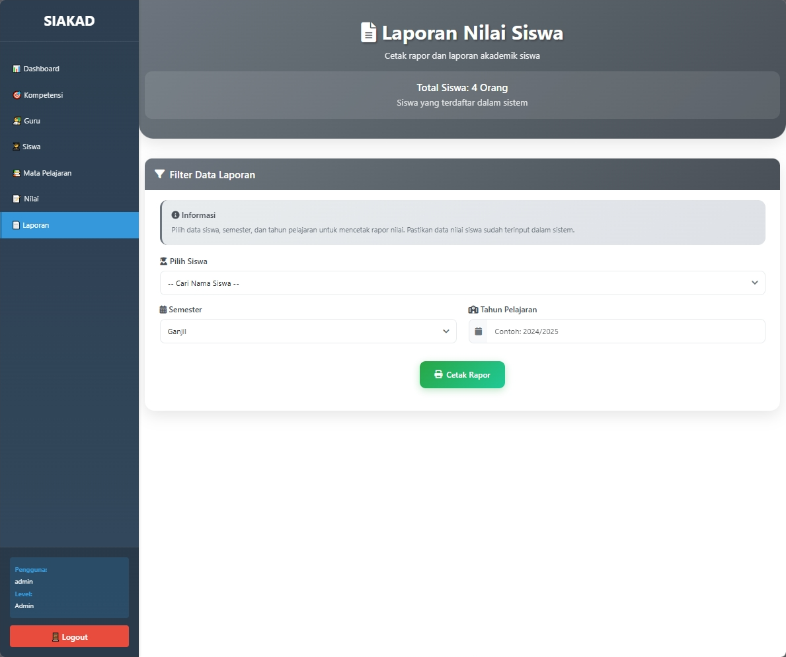
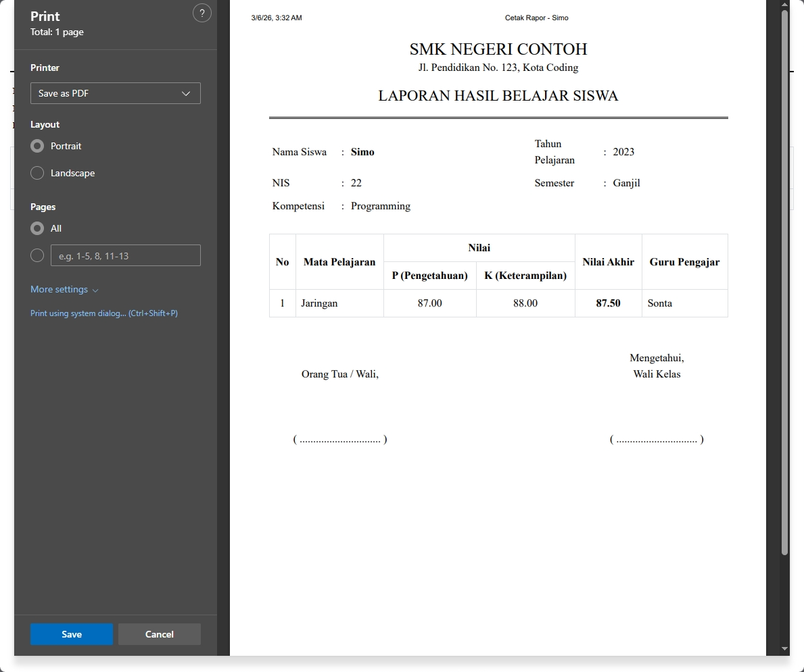

# SIAKAD - Sistem Informasi Akademik

SIAKAD adalah Sistem Informasi Akademik yang dirancang untuk mengelola data akademik sekolah atau institusi pendidikan. Aplikasi ini memudahkan pengelolaan data guru, siswa, mata pelajaran, nilai, dan kompetensi keahlian dengan antarmuka yang modern dan responsif.

# Screenshots 

*Contoh tampilan Login.*

*Contoh tampilan beranda setelah login.*

              

*Contoh hasil cetak laporan nilai siswa*

## 🎯 Fitur Utama

- ✅ **Manajemen Guru** - Kelola data guru, NIP, dan informasi kontak
- ✅ **Manajemen Siswa** - Input dan tracking data siswa per kompetensi
- ✅ **Manajemen Mata Pelajaran** - Atur mata pelajaran dengan guru pengajar dan kompetensi terkait
- ✅ **Manajemen Nilai** - Input nilai siswa per mata pelajaran dengan grading system
- ✅ **Manajemen Kompetensi** - Kelola kompetensi keahlian dan program keahlian
- ✅ **Sistem Autentikasi** - Login dengan session management
- ✅ **Responsive Design** - Tampilan optimal di desktop dan mobile
- ✅ **Modern UI** - Interface dengan gradient, animations, dan icon Font Awesome
- ✅ **Cetak Laporan** - Otomatis membuat PDF Laporan nilai siswa!!

## 🚀 Teknologi yang Digunakan

- **Backend**: PHP 7.4+
- **Database**: MySQL
- **Frontend**: HTML5, CSS3, JavaScript
- **Framework CSS**: Bootstrap 5
- **Icon Library**: Font Awesome 6
- **Server**: Apache (XAMPP)

## 📖 Panduan Penggunaan

### Dashboard
- Setelah login, Anda akan melihat dashboard dengan ringkasan data akademik

### Mengelola Data
1. **Guru**: Navigasi ke Menu → Guru untuk CRUD operations
2. **Siswa**: Menu → Siswa untuk mengelola data siswa
3. **Mata Pelajaran**: Menu → Mata Pelajaran untuk setup matpel
4. **Nilai**: Menu → Nilai untuk input dan tracking nilai siswa
5. **Kompetensi**: Menu → Kompetensi untuk manage kompetensi keahlian

## 🎨 UI/UX Features

- **Modern Gradient Design** - Setiap modul memiliki warna unik dan gradient yang menarik
- **Responsive Tables** - Tabel yang dapat menyesuaikan dengan ukuran layar
- **Smooth Animations** - Fade-in animations pada load page
- **Hover Effects** - Interactive button dan row effects
- **Mobile Friendly** - Optimal view di smartphone dan tablet

### Session Timeout
- Check `auth/cek_session.php` untuk durasi session
- Ubah nilai session timeout jika diperlukan

## 📄 License

Project ini dilisensikan di bawah MIT License - lihat file `LICENSE` untuk detail.

---

**Selamat menggunakan SIAKAD yang saya buat** 🎓

Terimakasih sudah menyempatkan waktu untuk melirik projek ini.
